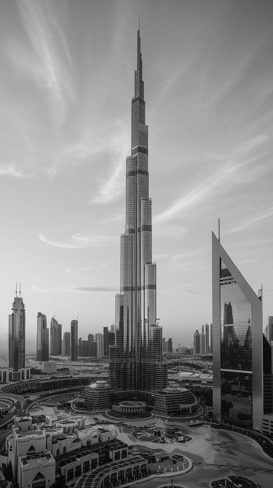
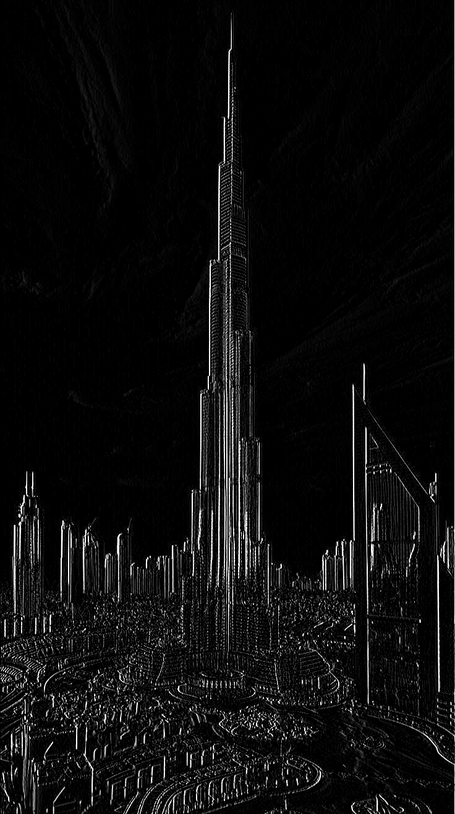
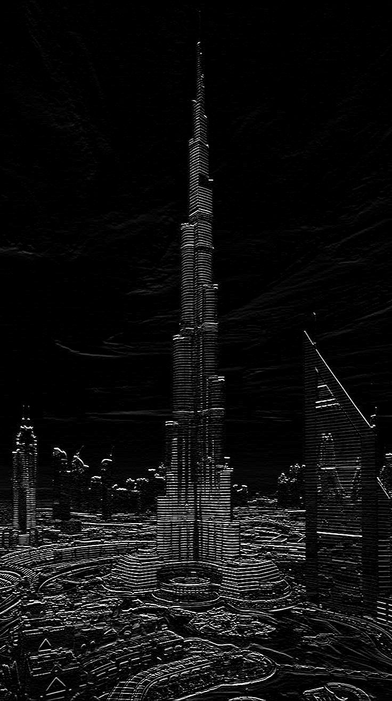

## **Filtros de Suavização (Passa-Baixa)**

\-\> Os filtros são de grande importância na visão computacional, pois quando adquirimos uma base de dados visual, muitas vezes, pode apresentar **ruído**; e para evitar erros devido à presença desse ruído, aplicamos diversos tipos de filtros para minimizar ao máximo o distúrbio que podem causar no resultado final. Esses filtros são chamados de **Passa-Baixa** ou **Filtros de Suavização**.

\-\> Esse repositório apresenta a aplicação manual (no arquivo `simple_filt.py`) do filtro de média e do filtro de mediana, ambos muito conhecidos:

  * **Filtro de média:** Substitui cada pixel da imagem pela média dos valores dos pixels vizinhos.
      * **Efeito:** Remove detalhes finos e pequenas texturas, resultando em uma imagem mais suave/embaçada.
  * **Filtro de mediana:** Substitui cada pixel pelo valor mediano dos pixels em sua vizinhança.
      * **Efeito:** Remove ruído sal e pimenta (pontos brancos/preto isolados).

    
    
    
</p\>

* Essas três imagens PARECEM iguais, devido ao tamanho do filtro usado ter sido pequeno, mas ao abrir em seu próprio computador, irão apresentar um leve **BLUR**.

-----

## **Detecção de Bordas (Filtros de Realce/Passa-Alta)**

\-\> A detecção de bordas utiliza métodos matemáticos para identificar pontos em uma imagem onde há uma **mudança significativa na luminosidade** das intensidades dos pixels.

    
    
    
</p\>

\-\> Os filtros de realce (também chamados de **Passa-Alta** ou de **Filtros de Gradiente**) enfatizam as regiões de bordas e os ruídos, e não enfatizam regiões constantes ou com variações de intensidade suaves.

\-\> O arquivo `detec_board.py` demonstra a aplicação de um **filtro de detecção de bordas horizontais**, que é um tipo de filtro de primeira derivada:

  * **Filtros de Primeira Derivada (Gradiente):** Baseiam-se na primeira derivada espacial da imagem para encontrar bordas.

      * **Exemplos Comuns:** Operadores de **Sobel** e Prewitt. O operador de Sobel utiliza dois *kernels* (máscaras) para calcular as derivadas parciais nas direções $x$ e $y$ (horizontal e vertical), permitindo encontrar bordas em ambas as direções. O gradiente resultante representa a magnitude e a direção das bordas.

  * **Filtros de Segunda Derivada:** Utilizam a segunda derivada espacial da imagem.

      * **Exemplos Comuns:** Operador **Laplaciano**. O Laplaciano é uma medida isotrópica bidimensional da derivada de segunda ordem. Ele realça transições abruptas de intensidade, como bordas, mas é sensível ao ruído e é frequentemente usado em conjunto com técnicas de suavização (como no Laplaciano do Gaussiano - LoG). O Laplaciano é geralmente mais rápido de ser computado que o Sobel.

O filtro implementado em `detec_board.py` usa o seguinte *kernel* para detecção de bordas horizontais (componente $G_x$, que enfatiza bordas verticais):

$$
\text{kernel\_detec} = \begin{pmatrix} 1 & 0 & -1 \\ 2 & 0 & -2 \\ 1 & 0 & -1 \end{pmatrix}
$$  * Este *kernel* corresponde ao filtro de Sobel na direção $x$.

* A demonstração em `detec_board.py` compara a aplicação do filtro usando a função `cv2.filter2D` e uma implementação manual com *loop* e *padding*. A implementação manual inclui a conversão para `np.int16` para permitir valores negativos do gradiente (diferença) antes do *clip* e conversão final para `np.uint8`.
