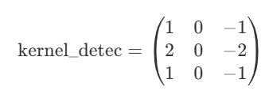
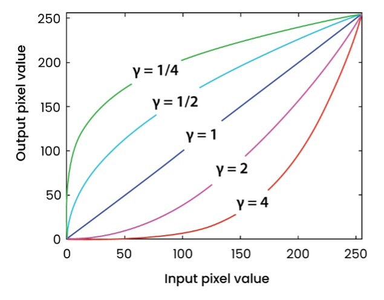
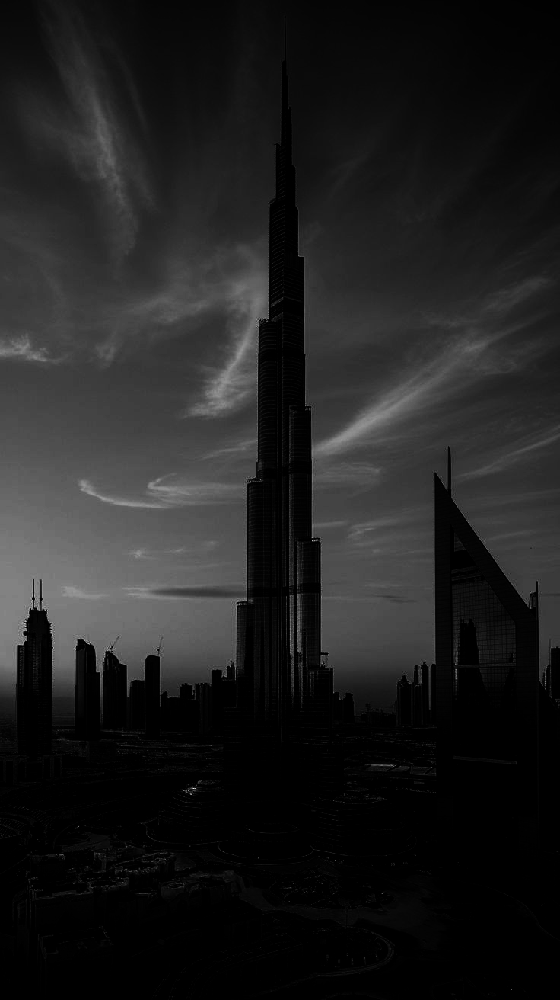
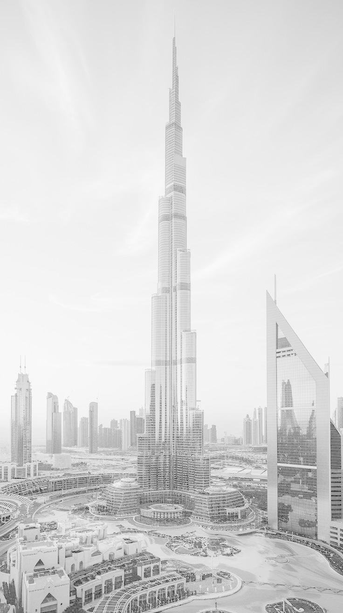
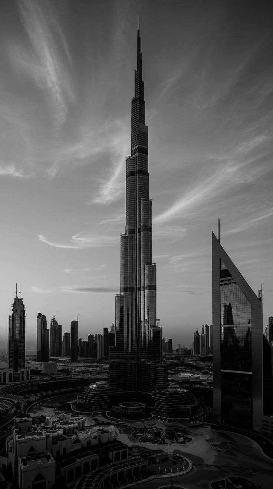
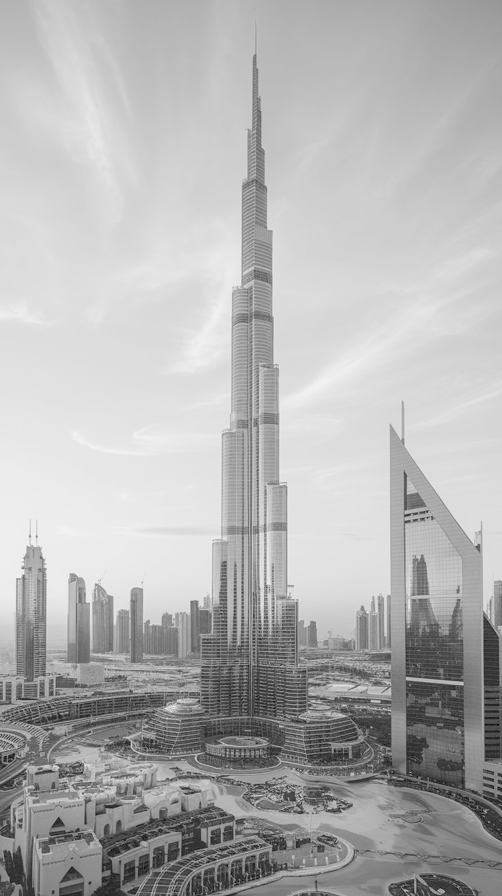
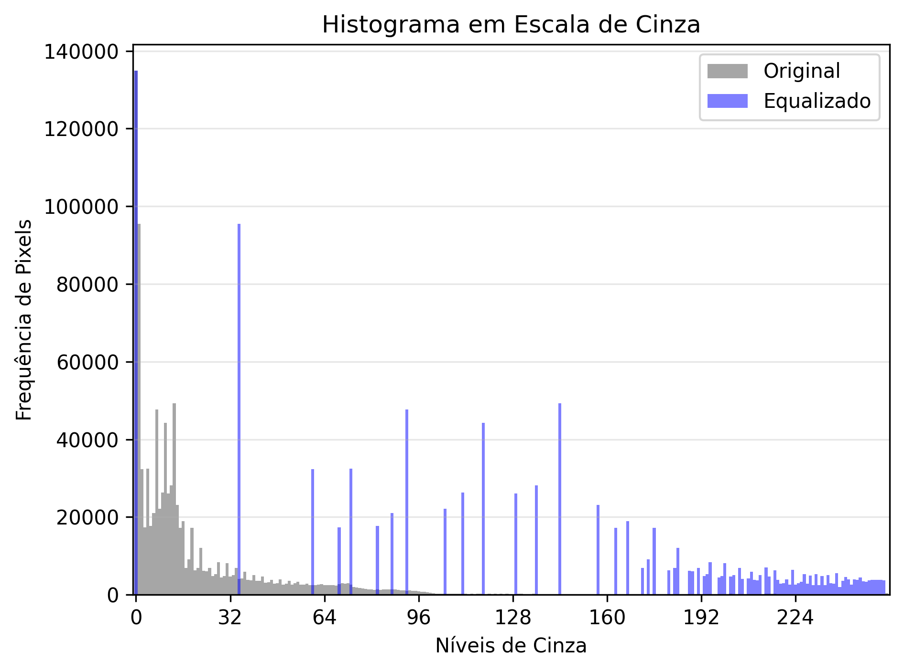

## **Filtros de Suavização (Passa-Baixa)**

\-\> Os filtros são de grande importância na visão computacional, pois quando adquirimos uma base de dados visual, muitas vezes, pode apresentar **ruído**; e para evitar erros devido à presença desse ruído, aplicamos diversos tipos de filtros para minimizar ao máximo o distúrbio que podem causar no resultado final. Esses filtros são chamados de **Passa-Baixa** ou **Filtros de Suavização**.

\-\> Esse repositório apresenta a aplicação manual (no arquivo `simple_filt.py`) do filtro de média e do filtro de mediana, ambos muito conhecidos:

  * **Filtro de média:** Substitui cada pixel da imagem pela média dos valores dos pixels vizinhos.
      * **Efeito:** Remove detalhes finos e pequenas texturas, resultando em uma imagem mais suave/embaçada.
  * **Filtro de mediana:** Substitui cada pixel pelo valor mediano dos pixels em sua vizinhança.
      * **Efeito:** Remove ruído sal e pimenta (pontos brancos/preto isolados).

    
    
    
</p\>

* Essas três imagens PARECEM iguais, devido ao tamanho do filtro usado ter sido pequeno, mas ao abrir em seu próprio computador, irão apresentar um leve **BLUR**.

-----

## **Detecção de Bordas (Filtros de Realce/Passa-Alta)**

\-\> A detecção de bordas utiliza métodos matemáticos para identificar pontos em uma imagem onde há uma **mudança significativa na luminosidade** das intensidades dos pixels.

    
    
    
</p\>

\-\> Os filtros de realce (também chamados de **Passa-Alta** ou de **Filtros de Gradiente**) enfatizam as regiões de bordas e os ruídos, e não enfatizam regiões constantes ou com variações de intensidade suaves.

\-\> O arquivo `detec_board.py` demonstra a aplicação de um **filtro de detecção de bordas horizontais**, que é um tipo de filtro de primeira derivada:

  * **Filtros de Primeira Derivada (Gradiente):** Baseiam-se na primeira derivada espacial da imagem para encontrar bordas.

      * **Exemplos Comuns:** Operadores de **Sobel** e Prewitt. O operador de Sobel utiliza dois *kernels* (máscaras) para calcular as derivadas parciais nas direções $x$ e $y$ (horizontal e vertical), permitindo encontrar bordas em ambas as direções. O gradiente resultante representa a magnitude e a direção das bordas.

  * **Filtros de Segunda Derivada:** Utilizam a segunda derivada espacial da imagem.

      * **Exemplos Comuns:** Operador **Laplaciano**. O Laplaciano é uma medida isotrópica bidimensional da derivada de segunda ordem. Ele realça transições abruptas de intensidade, como bordas, mas é sensível ao ruído e é frequentemente usado em conjunto com técnicas de suavização (como no Laplaciano do Gaussiano - LoG). O Laplaciano é geralmente mais rápido de ser computado que o Sobel.

O filtro implementado em `detec_board.py` usa o seguinte *kernel* para detecção de bordas horizontais (componente $G_x$, que enfatiza bordas verticais):

    
</p\>

* Este *kernel* corresponde ao filtro de Sobel na direção $x$.

* A demonstração em `detec_board.py` compara a aplicação do filtro usando a função `cv2.filter2D` e uma implementação manual com *loop* e *padding*. A implementação manual inclui a conversão para `np.int16` para permitir valores negativos do gradiente (diferença) antes do *clip* e conversão final para `np.uint8`.

---

## **Manipulação de Gama (Correção de Gama)**

A **manipulação de gama**, ou **correção de gama**, é uma técnica fundamental no processamento de imagens usada para ajustar a **luminosidade não linear** dos pixels. Câmeras, sensores e monitores possuem respostas luminosas diferentes, e a correção de gama serve para compensar essas variações e **melhorar o contraste perceptível** da imagem.

-> **Compreendendo o efeito do gama**

O gráfico abaixo mostra como o valor de saída (eixo Y) se relaciona ao valor de entrada (eixo X) para diferentes valores de \( \gamma \):

    

-> **Interpretação:**
- Curvas **côncavas** (γ < 1) — *clareiam* a imagem, realçando detalhes em regiões escuras.  
- Curvas **lineares** (γ = 1) — mantêm a imagem original.  
- Curvas **convexas** (γ > 1) — *escurecem* a imagem, realçando detalhes em áreas claras.

Essas transformações permitem **controlar o contraste dinâmico** e adaptar a imagem à forma como o olho humano percebe a luz.

-> **Importância da Correção de Gama**

Ajustar o gama é essencial em diversas áreas:

-  **Melhora o contraste dinâmico:**  
  Gamas menores (< 1) tornam a imagem mais clara, evidenciando detalhes em sombras.  

-  **Realça regiões escuras ou claras:**  
  Gamas maiores (> 1) tornam a imagem mais escura, evitando o “lavado” causado por brilho excessivo.  

-  **Correção de exibição:**  
  Essencial para calibrar imagens exibidas em diferentes telas, evitando distorções de luminosidade.  

-  **Visão computacional e machine learning:**  
  Usado como pré-processamento para melhorar o reconhecimento de padrões e objetos sob diferentes condições de iluminação.

    
    
    
    

---

## **Equalização de Histograma**

-> A *equalização de histograma* é uma técnica fundamental no processamento de imagens usada para melhorar o contraste global de uma imagem. Ela é particularmente útil para imagens que parecem "lavadas" ou que estão sub/superexpostas, onde os pixels estão concentrados em uma faixa muito estreita de intensidades.

-> O objetivo principal é *redistribuir as intensidades dos pixels* de forma mais uniforme por toda a faixa dinâmica (normalmente de 0 a 255 em escala de cinza). Isso é alcançado "esticando" o histograma da imagem.

-> Essencialmente, a técnica tenta mapear os níveis de cinza da imagem de entrada para que o histograma da imagem de saída seja o mais plano possível. Isso é feito usando a *Função de Distribuição Acumulada* (CDF) do histograma original como a função de mapeamento.

-> O script `equalization.py` demonstra a implementação manual desse processo, calculando o histograma, depois a CDF, e usando-a para mapear os valores de pixel antigos para novos valores.

   

Acima, a imagem da esquerda é a original, que possui baixo contraste e parece "acinzentada". A imagem da direita é o resultado após a equalização, onde os detalhes estão muito mais nítidos e o contraste foi significativamente melhorado.

-> A diferença no "espalhamento" dos pixels fica evidente ao comparar os histogramas das duas imagens:

  

No gráfico, o histograma Original (em cinza) mostra que a grande maioria dos pixels está condensada em uma faixa estreita no meio do espectro.

Após a equalização, o histograma Equalizado (em azul) mostra que as frequências dos pixels foram redistribuídas por uma faixa muito mais ampla de intensidades, confirmando o aumento do contraste dinâmico.

---

## Conversão de RGB para HSV e Equalização Baseada em Brilho

O espaço de cor HSV (Hue, Saturation, Value) é uma representação alternativa do modelo RGB, onde a informação de cor e luminosidade são separadas.
Enquanto no modelo RGB os três canais (vermelho, verde e azul) combinam cor e intensidade, no modelo HSV:

* **H (Hue / Matiz):** representa o tipo de cor (ângulo de 0° a 360° na roda de cores);
* **S (Saturation / Saturação):** indica o quão "pura" ou intensa é a cor;
* **V (Value / Brilho):** representa o nível de luminosidade.

Essa separação é extremamente útil em visão computacional, pois permite manipular apenas o brilho (V) sem alterar a coloração natural da imagem.

### 🔹 Conversão Manual de RGB → HSV

O arquivo `convertRGBtoHSV.py` demonstra o processo de conversão manual entre os espaços de cor.
Cada pixel RGB é convertido para HSV por meio das seguintes etapas:

1.  Normalização dos valores RGB: cada canal é dividido por 255.
2.  Cálculo dos valores máximo ($\text{max}$) e mínimo ($\text{min}$) entre (R, G, B).
3.  Determinação de $\Delta = \text{max} - \text{min}$ para definir o matiz (H).
4.  Cálculo dos componentes (ou variações conforme o canal dominante):

    $$H = 60 \times \left( \frac{g-b}{\Delta} \right)$$ 
    $$S = \frac{\Delta}{\max(R,G,B)}$$
    $$V = \max(R,G,B)$$

Após o cálculo, os valores são ajustados para o formato usado pelo OpenCV:

* $H \in [0, 180]$
* $S, V \in [0, 255]$

### 🔹 Equalização no Canal V (Brilho)

A equalização de histograma é mais eficiente quando aplicada no canal V do modelo HSV, pois ela atua diretamente sobre o brilho da imagem — sem distorcer cores ou tons.

O processo é o seguinte:

1.  Converter a imagem RGB para HSV.
2.  Separar os canais H, S e V.
3.  Aplicar a equalização **somente em V**.
4.  Reunir novamente os três canais (H, S, V).
5.  Converter de volta para RGB para exibição.

    

A primeira imagem é a fotografia original (retirada do pinterest!)
A segunda imagem mostra a equalização feita **diretamente em RGB** — que tende a alterar as cores originais.
A terceita mostra a **equalização via HSV**, preservando tons e aumentando o contraste de forma mais natural.

### 🔹 Importância do HSV para Equalização

* **Evita distorções de cor** causadas pela equalização independente de R, G e B.
* **Melhora o contraste percebido** sem alterar a aparência geral.
* **Facilita o pré-processamento** em visão computacional, tornando a imagem mais uniforme para algoritmos de segmentação e detecção.
* É amplamente usada em aplicações como realce de imagens médicas, processamento de vídeos e análise de cenas com iluminação variável.
